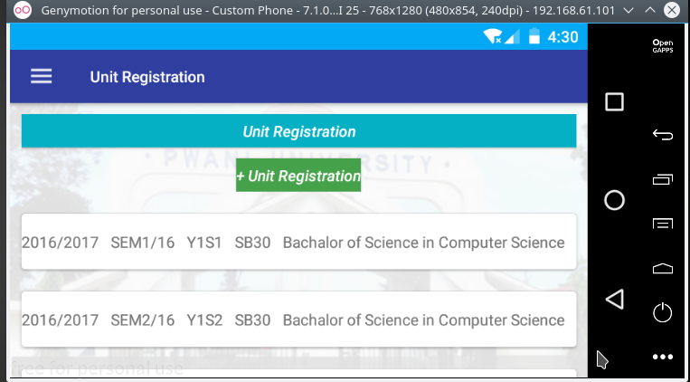
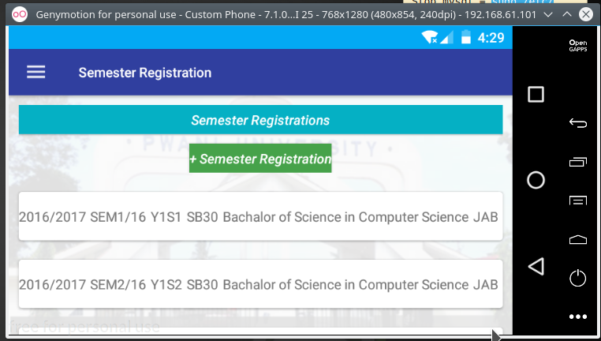
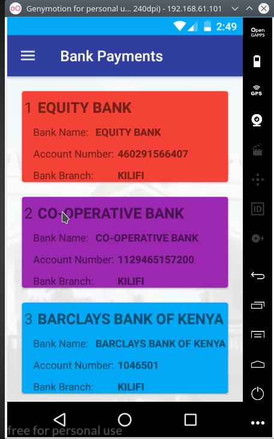
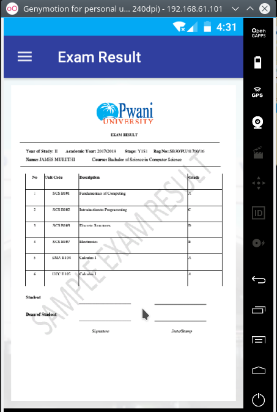
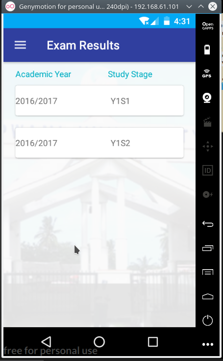
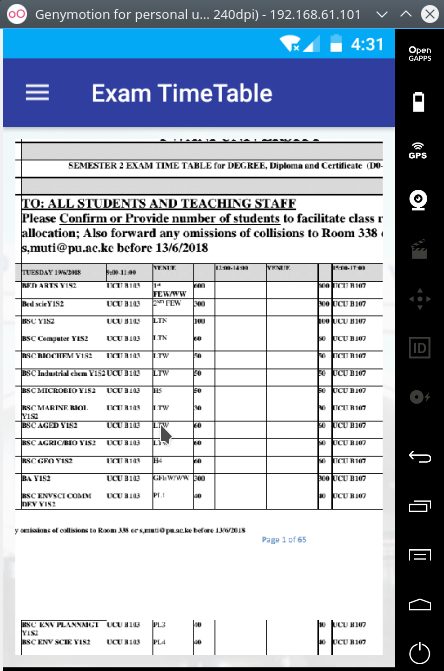
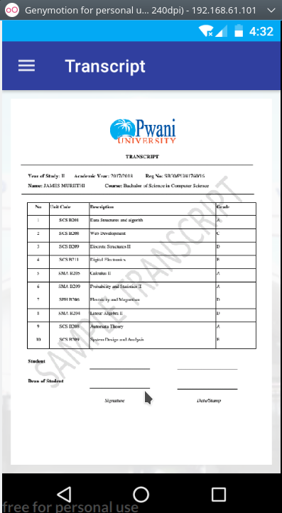
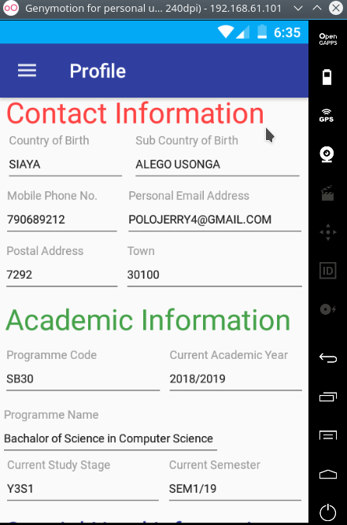

# PwaniUniversity
An application for Pwani University that cater for all students needs ie. Accessing Student ID, Fee Balance, Fee Statement, Semester Registration, Unit Registration and many more features.

|
|
|
|
|
|
|
|
|
|
|
|
|
